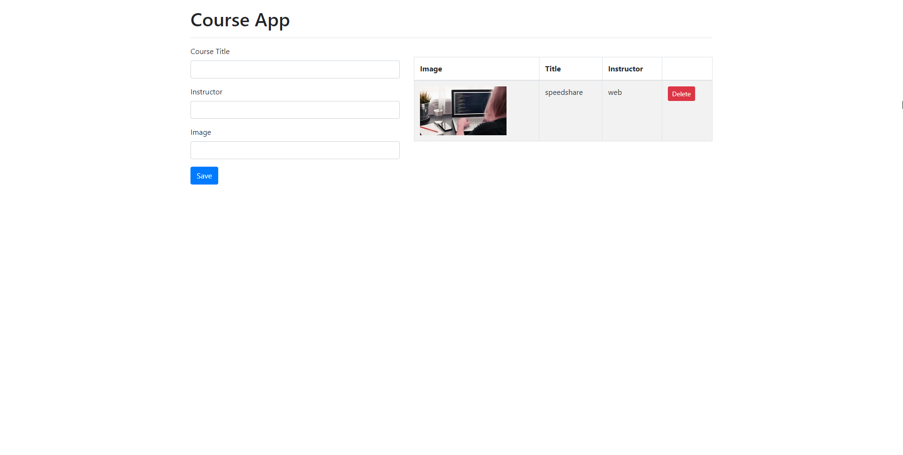
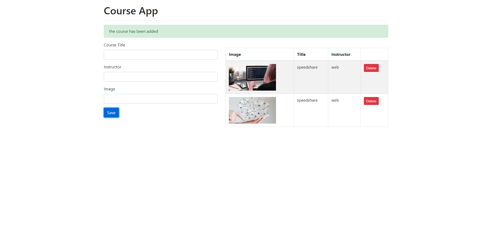
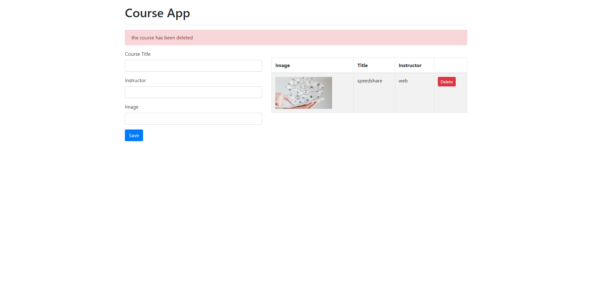

# Course-App

Simple dynamic online course app with JavaScript.

The project use local storage.

## Below are some project images.

* Course project page:

* When a course added:

* When a course deleted:

